<div align="center">

  <h1>💳 SiPP — Sistem Informasi Pembayaran SPP</h1>

  <p>Aplikasi web untuk mengelola pembayaran SPP sekolah secara digital — dari pencatatan data siswa, entri pembayaran oleh petugas, hingga laporan rekapitulasi dan ekspor data.</p>

  <p>
    
    
    
    
    
  </p>

</div>

---

## 📋 Daftar Isi

- [Tentang Proyek](#-tentang-proyek)
- [Peran Pengguna](#-peran-pengguna)
- [Fitur](#-fitur)
- [Screenshot](#-screenshot)
- [Tech Stack](#-tech-stack)
- [Instalasi](#-instalasi)
- [Akun Demo](#-akun-demo)
- [Struktur Database](#-struktur-database)
- [Struktur Proyek](#-struktur-proyek)
- [Author](#-author)

---

## 📖 Tentang Proyek

**SiPP (Sistem Informasi Pembayaran SPP)** adalah aplikasi web yang dirancang untuk membantu sekolah mengelola pembayaran SPP siswa secara terstruktur — menggantikan pencatatan manual dengan sistem digital yang bisa diakses oleh tiga peran berbeda: **Admin**, **Petugas**, dan **Siswa**.

Dibangun dengan **Laravel 12** sebagai backend dan **React + Inertia.js** sebagai frontend (tanpa REST API terpisah — satu codebase, render server-driven), aplikasi ini menyajikan antarmuka modern dengan desain navy/blue yang konsisten di seluruh halaman, lengkap dengan dashboard, laporan, serta ekspor/impor data berbasis Excel.

---

## 👥 Peran Pengguna

| Peran       | Hak Akses                                                                                                                             |
| ----------- | ------------------------------------------------------------------------------------------------------------------------------------- |
| **Admin**   | Kelola seluruh master data (Siswa, Petugas, Kelas, SPP), lihat histori pembayaran semua siswa, generate & ekspor laporan rekapitulasi |
| **Petugas** | Input pembayaran SPP (entri transaksi), lihat histori pembayaran (default miliknya sendiri, bisa difilter ke petugas lain)            |
| **Siswa**   | Lihat dashboard status pembayaran pribadi (lunas/belum per bulan) dan histori pembayaran miliknya sendiri                             |

Setiap peran memiliki dashboard dan menu sidebar yang berbeda, dikontrol melalui middleware role di level route.

---

## ✨ Fitur

- 🔐 **Autentikasi & Role-Based Access** — Login dengan email & password, redirect otomatis ke dashboard sesuai peran
- 📊 **Dashboard per Peran** — Statistik ringkas, tren pembayaran 6 bulan terakhir (Admin), aktivitas transaksi terbaru (Petugas), status pembayaran bulanan (Siswa)
- 👨‍🎓 **Manajemen Data Siswa** — CRUD lengkap, otomatis membuat akun login siswa, ekspor & impor Excel dengan template siap pakai
- 👨‍💼 **Manajemen Data Petugas** — CRUD lengkap dengan akun login, ekspor & impor Excel
- 🏫 **Manajemen Data Kelas** — CRUD dengan validasi tingkat (X/XI/XII), ekspor & impor Excel dengan dropdown validasi
- 💰 **Manajemen Data SPP** — Buat tarif SPP untuk satu tahun ajaran penuh (12 bulan) dalam satu kali input
- 💳 **Entri Pembayaran** — Form pencarian siswa, deteksi otomatis bulan yang belum dibayar, pencegahan pembayaran ganda
- 📜 **Histori Pembayaran** — Riwayat transaksi dengan scope berbeda sesuai peran, filter berdasarkan bulan/kelas/petugas
- 📈 **Laporan Rekapitulasi** — Generate laporan per bulan & tahun ajaran, ringkasan lunas/belum lunas, cetak langsung dari browser
- 📤 **Ekspor & Impor Excel** — Setiap modul master data mendukung ekspor data (.xlsx) dan impor massal lewat template yang bisa diunduh
- 🖨️ **Ekspor PDF** — Laporan dapat diunduh dalam format PDF
- 📱 **Desain Responsif** — Sidebar dengan mode hamburger di perangkat tablet/mobile
- 🔔 **Notifikasi Real-time** — Toast konfirmasi untuk setiap aksi (simpan, hapus, impor)

---

## 📸 Screenshot

<!-- > **Petunjuk untuk pemilik repo:** Folder `public/screenshots/` belum tersedia. Buat folder tersebut, tambahkan
> screenshot aplikasi, lalu sesuaikan nama file pada tautan gambar di bawah. -->

### Halaman Login

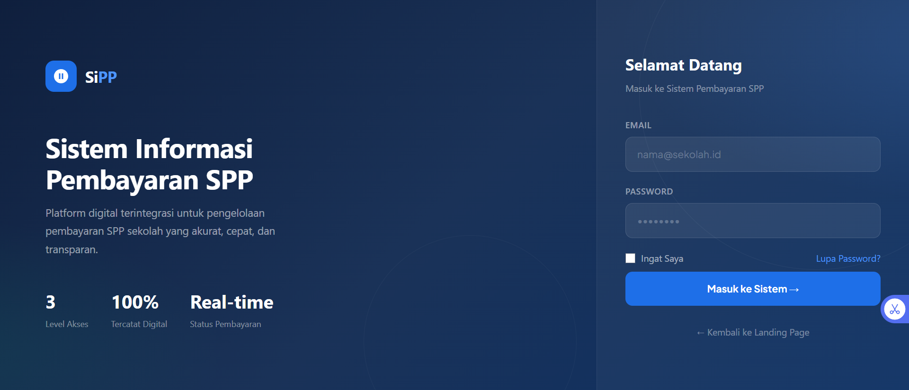

### Dashboard Siswa

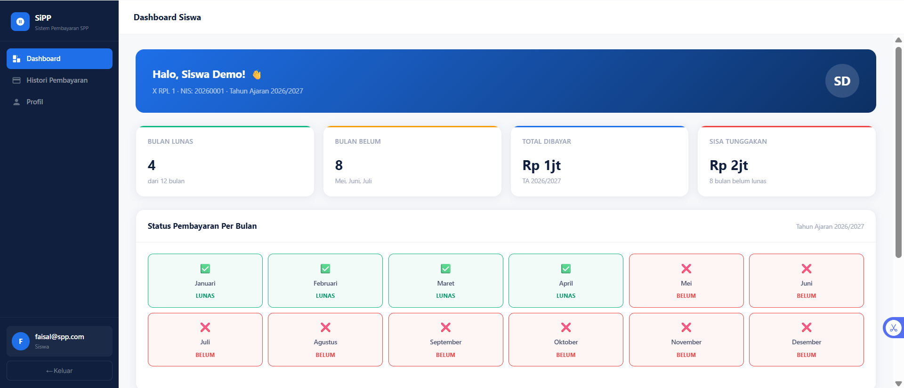

### Histori Pembayaran Siswa

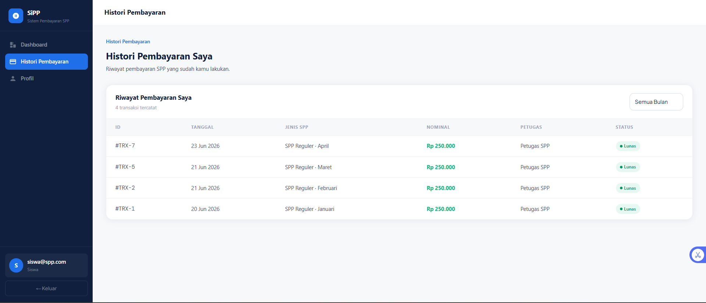

### Dashboard Petugas

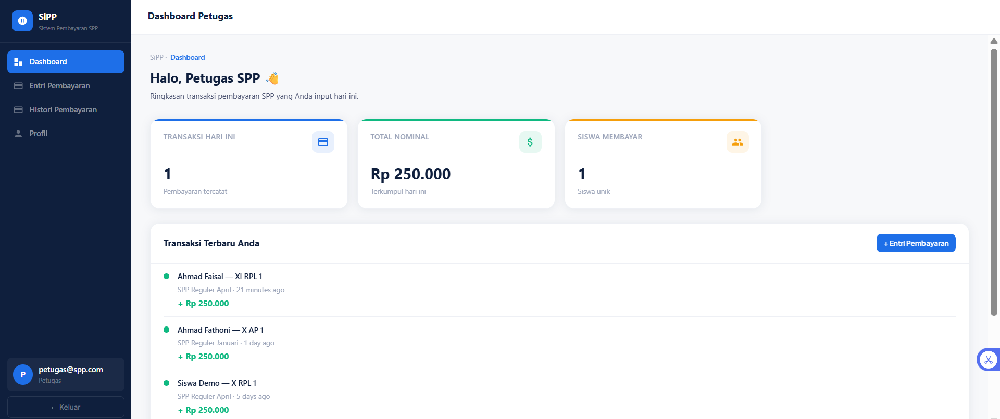

### Entri Pembayaran (Petugas)

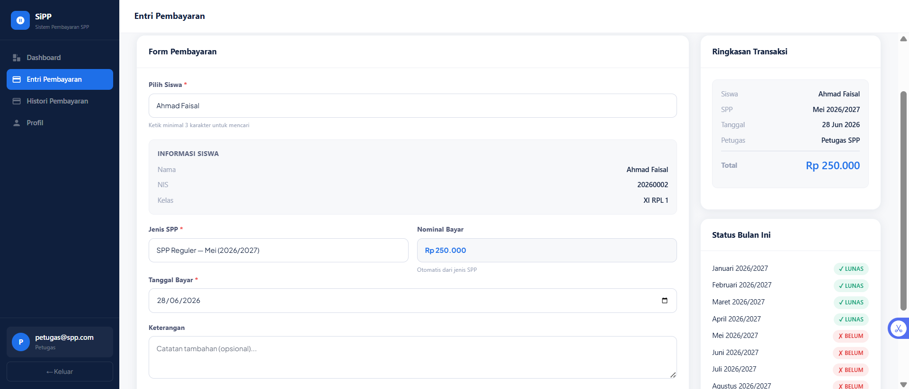

### Histori Pembayaran Petugas

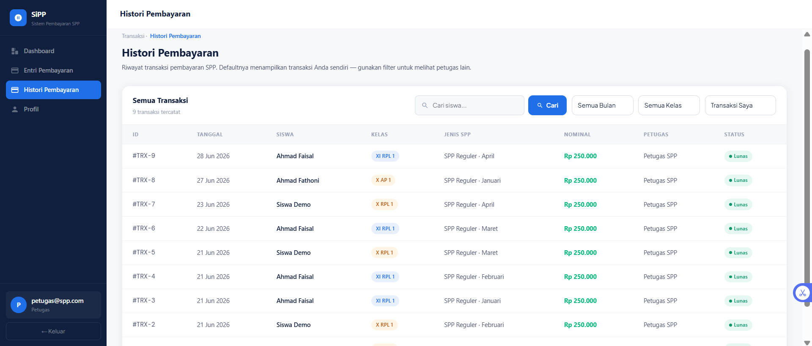

### Dashboard Admin

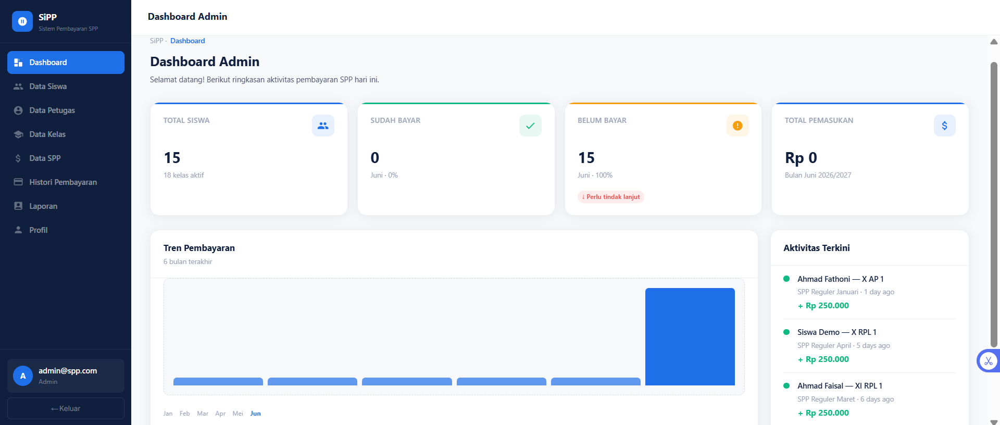

### Data Siswa

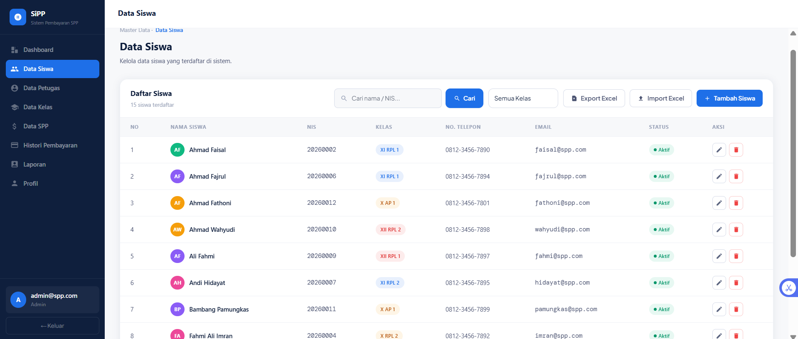

### Data Petugas

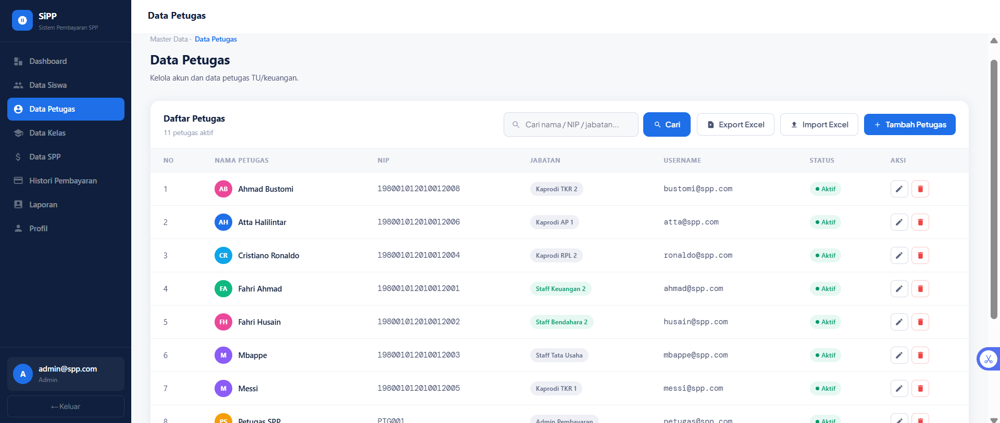

### Data Kelas

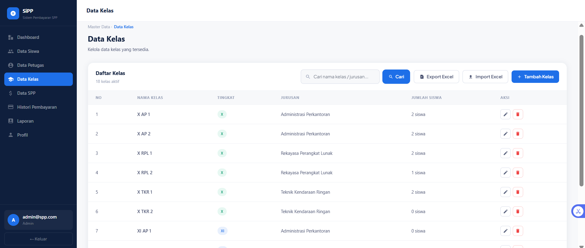

### Data SPP

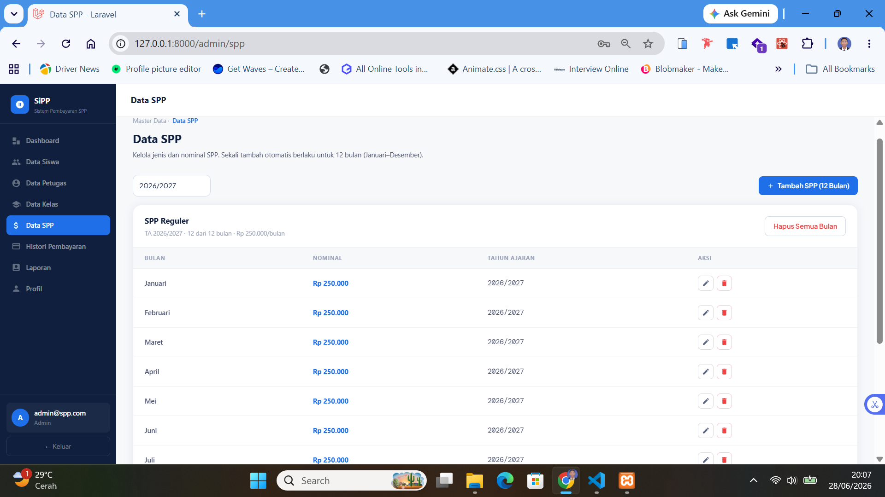

### Histori Pembayaran Admin

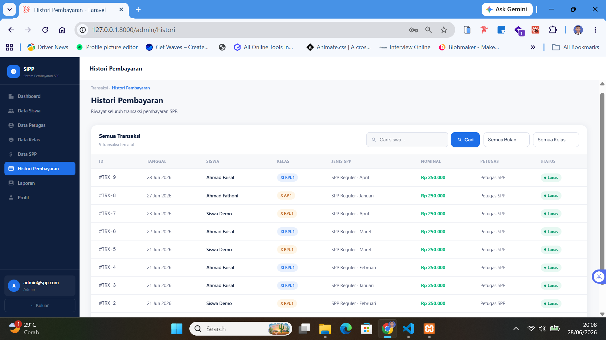

### Laporan Rekapitulasi

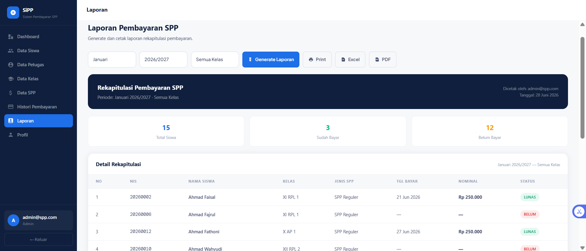

### Profile

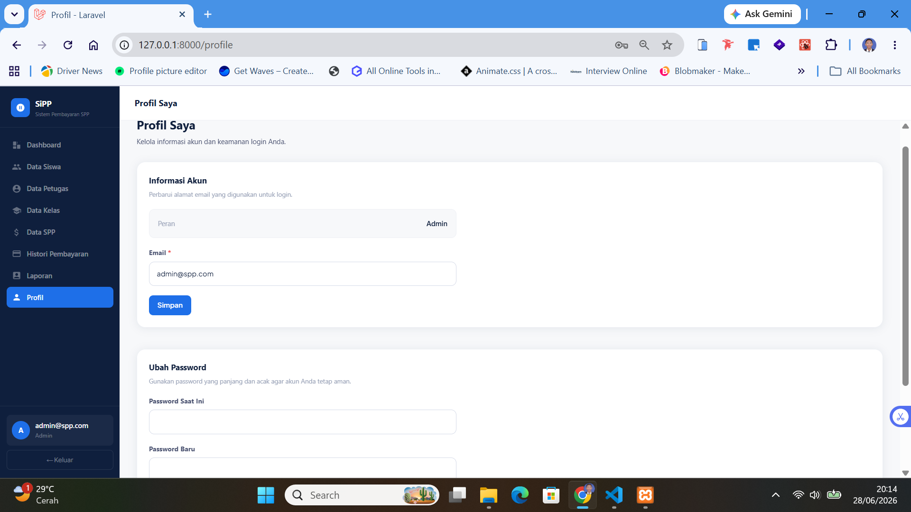

---

## 🛠️ Tech Stack

### Backend

| Paket                        | Versi | Fungsi                                                    |
| ---------------------------- | ----- | --------------------------------------------------------- |
| Laravel                      | ^12.0 | Framework utama                                           |
| PHP                          | ^8.2  | Runtime                                                   |
| Inertia.js (Laravel adapter) | ^2.0  | Jembatan Laravel ↔ React tanpa REST API terpisah          |
| Maatwebsite Excel            | ^3.1  | Ekspor & impor data ke/dari Excel                         |
| barryvdh/laravel-dompdf      | ^3.1  | Generate dokumen PDF                                      |
| Laravel Sanctum              | ^4.0  | Autentikasi berbasis token (tersedia untuk kebutuhan API) |
| Ziggy                        | ^2.0  | Akses named route Laravel dari sisi JavaScript            |

### Frontend

| Paket                      | Versi | Fungsi                              |
| -------------------------- | ----- | ----------------------------------- |
| React                      | ^18.2 | UI library                          |
| Inertia.js (React adapter) | ^2.0  | Render halaman dari respons Laravel |
| TypeScript                 | ^5.0  | Type-safe JavaScript                |
| Vite                       | ^7.0  | Build tool & dev server             |

Styling memakai CSS custom (design token berbasis CSS variables) tanpa framework utility seperti Tailwind, agar konsisten dengan desain antarmuka yang dirancang khusus untuk aplikasi ini.

---

## 🚀 Instalasi

### Prasyarat

- PHP ^8.2 dengan ekstensi umum Laravel (mbstring, pdo, openssl, dll)
- Composer
- Node.js ^18 & npm

### Langkah-langkah

```bash
# 1. Clone repository
git clone https://github.com/saepudinasep/sipp-laravel.git
cd sipp-laravel

# 2. Install dependency PHP
composer install

# 3. Salin file environment
cp .env.example .env

# 4. Generate application key
php artisan key:generate

# 5. Jalankan migrasi & seeder (akun demo + data contoh)
php artisan migrate --seed

# 6. Install dependency JavaScript
npm install

# 7. Build aset frontend
npm run build

# 8. Jalankan server
php artisan serve
```

Aplikasi dapat diakses di `http://127.0.0.1:8000`.

### Mode Pengembangan

Untuk pengembangan dengan hot-reload, jalankan dua proses berikut secara bersamaan di terminal terpisah:

```bash
php artisan serve
npm run dev
```

### Konfigurasi Database

Default menggunakan **SQLite** (tanpa konfigurasi tambahan — file `database/database.sqlite` dibuat otomatis saat `composer install`). Untuk beralih ke **MySQL**, edit file `.env`:

```env
DB_CONNECTION=mysql
DB_HOST=127.0.0.1
DB_PORT=3306
DB_DATABASE=sipp_db
DB_USERNAME=root
DB_PASSWORD=password_kamu
```

Lalu jalankan ulang migrasi:

```bash
php artisan migrate:fresh --seed
```

---

## 🔑 Akun Demo

Tersedia setelah menjalankan `php artisan migrate --seed`:

| Peran   | Email             | Password   |
| ------- | ----------------- | ---------- |
| Admin   | `admin@spp.com`   | `password` |
| Petugas | `petugas@spp.com` | `password` |
| Siswa   | `siswa@spp.com`   | `password` |

---

## 🗄️ Struktur Database

Tabel-tabel utama yang digunakan aplikasi:

```
┌────────────────────────────────────────────────────────────────┐
│                        SIPP DATABASE                           │
├───────────────┬──────────────────────────────────────────────--┤
│ users         │ id, email, role (admin/petugas/siswa),         │
│               │ is_active, password, timestamps, soft delete   │
├───────────────┼──────────────────────────────────────────────--┤
│ siswas        │ id, nis, nama, kelas_id, alamat, telp, user_id │
│ petugas       │ id, nip, nama, jabatan, user_id                │
│ kelas         │ id, nama_kelas, tingkat (X/XI/XII), jurusan    │
├───────────────┼──────────────────────────────────────────────--┤
│ spps          │ id, jenis, nominal, bulan, tahun_ajaran        │
│               │ (unique per jenis+bulan+tahun_ajaran)          │
│ transaksis    │ id, siswa_id, spp_id, petugas_id, tgl_bayar,   │
│               │ nominal, keterangan                            │
│ log_transaksis│ id, transaksi_id, aksi, keterangan, waktu      │
└───────────────┴──────────────────────────────────────────────--┘
```

**Relasi inti:**

- `siswas` dan `petugas` masing-masing terhubung 1-ke-1 dengan `users` (akun login terpisah dari data profil)
- `siswas` terhubung ke `kelas` (banyak siswa per kelas)
- `transaksis` menghubungkan siswa, jenis SPP yang dibayar, dan petugas yang mencatatnya
- Satu jenis SPP dibuat untuk satu tahun ajaran penuh (12 baris bulan sekaligus), bukan satu per satu

Skema lengkap tersedia di folder `database/migrations/`. Jalankan `php artisan migrate` untuk membuat seluruh tabel secara otomatis.

---

## 📁 Struktur Proyek

Beberapa direktori penting yang spesifik untuk aplikasi ini (di luar struktur standar Laravel):

```
app/
├── Exports/            # Class ekspor Excel (Siswa, Petugas, Kelas, Laporan, dll)
├── Imports/            # Class impor Excel dengan validasi per baris
└── Http/Controllers/   # SiswaController, PetugasController, KelasController,
                        # SppController, TransaksiController, LaporanController,
                        # DashboardController, dll

resources/js/
├── Components/         # Sidebar, Header, Pagination, LoadingButton, dll
├── Layouts/            # AppLayout (shell dashboard), GuestLayout
└── Pages/
    ├── Admin/          # Halaman khusus peran Admin
    ├── Petugas/        # Halaman khusus peran Petugas
    └── Siswa/          # Halaman khusus peran Siswa
```

---

## 👤 Author

<table>
  <tr>
    <td align="center">
      <a href="https://github.com/saepudinasep">
        <br />
        <b>Saepudin Asep</b>
      </a>
      <br />
      <a href="https://github.com/saepudinasep">@saepudinasep</a>
    </td>
  </tr>
</table>

---

<div align="center">
  <p>Dibuat dengan ❤️ menggunakan Laravel & React</p>
  <p>
    <a href="https://github.com/saepudinasep/sipp-laravel/issues">Laporkan Bug</a> ·
    <a href="https://github.com/saepudinasep/sipp-laravel/issues">Request Fitur</a>
  </p>
</div>
